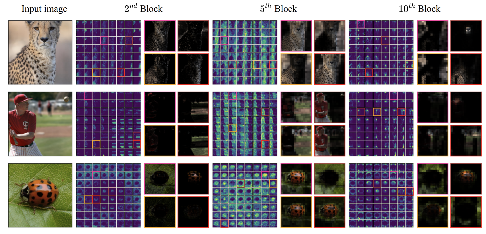

# [GLNet (NeurIPS 2024)](https://neurips.cc/virtual/2024/poster/93308)

Official PyTorch implementation of **GLNet**, from the following paper:

[Revisiting the Integration of Convolution and Attention for Vision Backbone](https://arxiv.org/abs/2411.14429). NeurIPS 2024.\
[Lei Zhu](https://rayleizhu.github.io), [Xinjiang Wang](https://scholar.google.com/citations?user=q4lnWaoAAAAJ&hl=en), [Wayne Zhang](http://www.statfe.com/), and [Rynson Lau](https://openreview.net/profile?id=~Rynson_W._H._Lau1)

--- 
<p align="left">

</p>
<p align="left">

</p>

## Features of This Repository

This repository is designed to run experiments in an **elegant** and **highly automated** manner. The key features to achieve such a goal are:

* Integration of hydra configuration system for efficient experiment management. See [here](https://github.com/rayleizhu/GLMix/blob/f01679c067fcfed78b951e7464c6f583118733d7/main_cx2.py#L379).
* Advanced support for slurm clusters. See [slurm_wrapper.py](slurm_wrapper.py).
* Auto resume functionality to finish experiments in preemptive clusters. See [here](https://github.com/rayleizhu/GLMix/blob/f01679c067fcfed78b951e7464c6f583118733d7/main_cx2.py#L258).
* Integration of timm benchmark tools to get FLOPs and Throughputs automatically. See [here](https://github.com/rayleizhu/GLMix/blob/f01679c067fcfed78b951e7464c6f583118733d7/main_cx2.py#L136).
* Integration of Tensorboard for training visualization. See [here](https://github.com/rayleizhu/GLMix/blob/f01679c067fcfed78b951e7464c6f583118733d7/main_cx2.py#L290)
* Integration of tools for IO optimization. See [here](https://github.com/rayleizhu/GLMix/blob/f01679c067fcfed78b951e7464c6f583118733d7/main_cx2.py#L101).

Besides, you can find configurable visualization scripts tailored for the GLNet family in [visualization/](visualization/).


## Quick Start

Setup environment and prepare data according to the [installation guide](INSTALL.md), then execute the command below to evaluate our [released checkpoints](https://github.com/rayleizhu/GLMix/blob/f01679c067fcfed78b951e7464c6f583118733d7/models/glnet.py#L12).

```bash
# It should finally report something like:
# * Acc@1 84.982 Acc@5 97.282 loss 0.774
# Accuracy of the model on 50000 test images: 84.98200%
python main_cx2.py \
    data_path=./data/in1k input_size=224  batch_size=128 dist_eval=true \
    eval=true model='glnet_16g' load_release=true \
    # +slurm=${CLUSTER_ID} slurm.nodes=2 slurm.ngpus=8
    # Add the commented line above if you are on a slurm cluster.
    # Make sure configs/slurm/{CLUSTER_ID}.yaml is created.
```

## Detailed Guide

* You don't need to download checkpoints manually; the script will download them automatically to `~/.cache/torch/hub/checkpoints/[MODEL_NAME].pth`.
* With regular training recipe [main_cx2.py](main_cx2.py), availble models are  `glnet_4g`, `glnet_9g`, `glnet_16g`, `glnet_stl`, `glnet_stl_paramslot`.
* For token labeling models, use [main_tklb.py](main_tklb.py), available models are `glnet_4g_tklb`, `glnet_9g_tklb`. These models have better performances for IN1k classification (see Tab. 3 in our paper).
* For training, please remove the `eval=True` flag. To reproduce the reported results, ensure hyperparameters are correctly set (Tab. 8 & Tab. 9) as those in the paper (Appendix).
  * Generally, you can leave most hyperparameters default, with only `drop_path=xx lr=2e-3 clip_grad=5.0` being set manually.
  * The `drop_path` for `glnet_4g`/`glnet_9g`/`glnet_16g` is 0.15/0.3/0.4. For stl (Swin-Tiny-Layout) models (`glnet_stl`/`glnet_stl_paramslot`) and token labeling models (`glnet_4g_tklb`/`glnet_9g_tklb`)  we use 0.1.
  * We use a global batch size of 2048. The global batch size is `batch_size * gpus_per_node * num_nodes * update_freq`. If you do not have enough memory, try to set `update_freq` larger than 1 for gradient accumulation (we did not try it, though).

## Model Card

| name | acc@1 | #params | FLOPs | log |
|:--- |:---:|:---:|:---:| :---:|
| glnet_4g            | 83.7 | 27 M   | 4.5 G  | [log](https://1drv.ms/t/s!AkBbczdRlZvCyE2s3jq9r-geapCU?e=JbENP6) |
| glnet_9g            | 84.5 | 60 M   | 9.7 G  | [log](https://1drv.ms/t/s!AkBbczdRlZvCx2JesuOSJyvWm8x2?e=diGJxd) |
| glnet_16g           | 85.0 | 106 M  | 16.7 G | [log](https://1drv.ms/t/s!AkBbczdRlZvCxxGJNnm2IAYQ6rNJ?e=XhTogD) |
| glnet_4g_tklb       | 84.4 | 27 M   | 4.5 G | [log](https://1drv.ms/t/s!AkBbczdRlZvCx0uJW-LbILuibh0O?e=hdg4mW) |
| glnet_9g_tklb       | 85.3 | 61 M   | 9.7 G | [log](https://1drv.ms/t/s!AkBbczdRlZvCyGD00zCBpqG3dNX-?e=C0bdyB) |
| glnet_stl           | 82.5 | 30 M   | 4.4 G | [log](https://1drv.ms/t/s!AkBbczdRlZvCyA4sh1GAWZaw_87w?e=kCoJd2) |
| glnet_stl_paramslot | 82.1 | 30 M   | 4.4 G | [log](https://1drv.ms/t/s!AkBbczdRlZvCyBqPhdcKNxNb43Bp?e=FbPJel) |

## TODOs
- [x] camera-ready paper link
- [x] IN1k standard training code, logs, and checkpoints
- [x] IN1k token-labeling code, logs, and checkpoint
- [x] visualization scripts
- [x] arXiv link
- [ ] semantic segmentation and object detection code
- [ ] a guide for running on multiple GPUs without Slurm
  - this should be simple with `torchrun`. Contributions are welcome.
- [ ] add legacy models (e.g., BiFormer)
- [ ] support [Ascend NPU](https://github.com/Ascend/pytorch)
<!-- ✅ ⬜️  -->

## Acknowledgement
This repository is built using the [timm](https://github.com/rwightman/pytorch-image-models) library, and [BiFormer](https://github.com/rayleizhu/BiFormer/tree/public_release), [ConvNext](https://github.com/facebookresearch/ConvNeXt-V2) repositories.

## License
This project is released under the MIT license. Please take a look at the [LICENSE](LICENSE) file for more information.

## Citation
If you find this repository helpful, please consider citing:
```bibtex
@article{zhu2024glnet,
  title={Revisiting the Integration of Convolution and Attention for Vision Backbone},
  author={Zhu, Lei and Wang, Xinjiang and Zhang, Wayne and Lau, Rynson},
  journal={Advances in Neural Information Processing Systems},
  year={2024}
}
```
